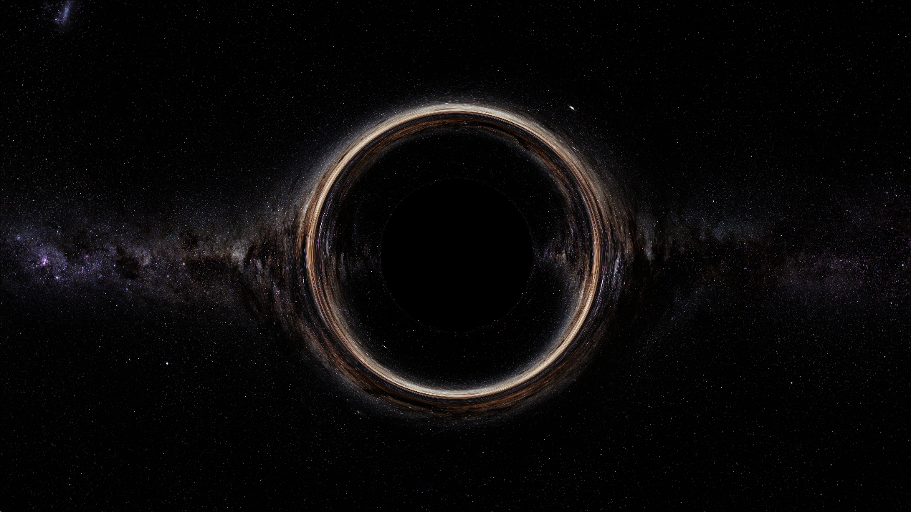

# Black hole raytracer

This project implements a GPU-based raytracer to simulate light propagation in Schwarzschild spacetime and render visualizations of a black hole.

# References    

This project uses a background image released by the **European Southern Observatory (ESO)** under the [Creative Commons Attribution 4.0 International License](https://creativecommons.org/licenses/by/4.0/).
Image: *Milky Way panorama* (ESO/S. Brunier)
Source: [ESO Image Archive](https://www.eso.org/public/images/eso0932a/)

